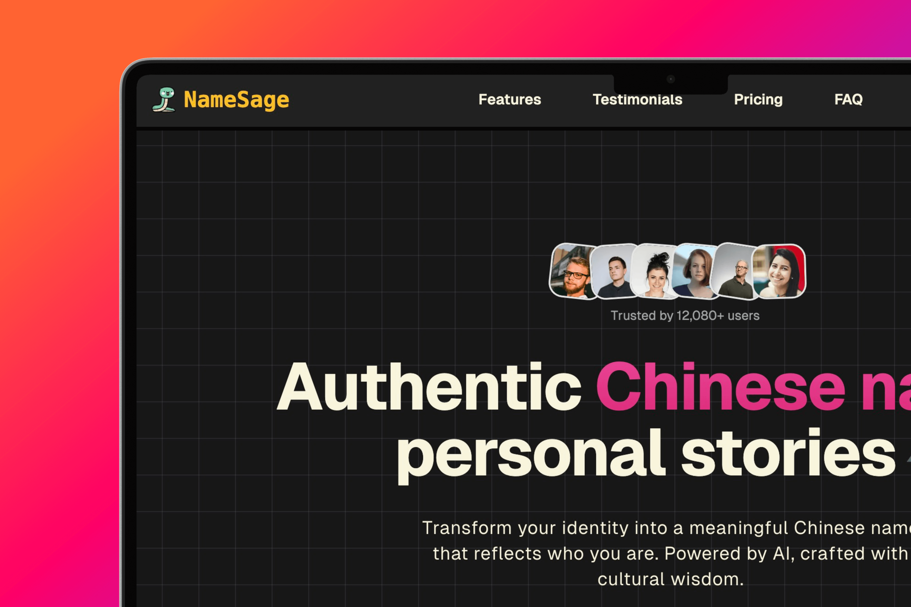

# NameSage - AI-Powered Chinese Name Generator 🎯

[English](README.md) | [简体中文](README_zh.md)

A modern web application that generates culturally appropriate Chinese names for non-native speakers, powered by AI technology and featuring a Neobrutalism design style.

## 📸 Preview



## ✨ Key Features

- 🤖**AI-Powered Generation**: Creates Chinese names based on personal characteristics and preferences
- 🎯 **Cultural Context**: Provides detailed explanations of name meanings and cultural significance
- 🔍**Character Analysis**: Includes stroke counts and explanations for each character
- 🔉**Pronunciation Guides**: Offers Pinyin support for accurate pronunciation
- 🔄**Multiple Suggestions**: Generates multiple name options for selection
- 🌍**Cross-Cultural Adaptation**: Adapts names to suit cultural preferences
- 💫**Professional Verification**: Ensures name suitability and cultural appropriateness
- 📖**Personal Stories**: Integrates personal stories and meanings into name suggestions

## 🛠️ Tech Stack

- **Framework**: Next.js 15 (App Router)
- **Language**: TypeScript
- **Styling**:
  - Tailwind CSS
  - Neobrutalism Design System
- **UI Components**:
  - Shadcn UI
  - Radix UI
- **Icons**: Lucide React
- **State Management**: React Hooks
- **AI Integration**: DeepSeek API

## 🚀 Getting Started

1. Clone the repository:

```bash
git clone https://github.com/hellokaton/namesage.git
```

2. Install dependencies:

```bash
pnpm install
```

3. Set up environment variables:

```bash
cp .env.example .env.local
```

4. Start the development server:

```bash
pnpm dev
```

## 💡 Usage

1. Enter your English name and personal details
2. Choose your preferences for name characteristics
3. Receive multiple AI-generated Chinese name options
4. View detailed explanations for each name
5. Select your favorite name with cultural context

## 🤝 Contributing

Contributions are welcome! Please feel free to submit a Pull Request.

## 📝 License

[MIT](LICENSE)

## 🙏 Acknowledgments

- UI components from [shadcn/ui](https://ui.shadcn.com)
- Icons from [Lucide](https://lucide.dev)
- AI powered by deepseek
