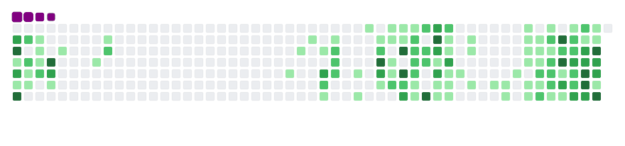

# Hi 👋, I'm MeetQY

- 🤔 强制刷新，左侧的图片可以随机更换，嘿嘿
- 🔭 我的个人网站 [wcao.cc](https://wcao.cc)
- 🔓 喜欢写写模板
- 🌶 常用的技术: `Flutter`/`Vue`/`Js`/`Ts`/`React`/`TailwindCss`/`Node`
- 🔥 常用的 UI 库: `DaisyUI`/`Antd`等还未发现的多主题、炫酷、有眼缘的 UI 库
- 🤩 CV 大法好呀，CV 大法妙

> 算了，编不下去了，来一首《再别康桥》片段凑凑字数。

```text
-...----.----.--/-...----.----.--/---.--.-....-../--...-....-...-/-...--.-.---..../-..---.-....--./--------....--..

--.-.--.--...--/-.--..--.....-./--...-....-...-/-...----.----.--/-...----.----.--/---.--.-....-../--..---.--..-.-/--------...--.--

--...-....-...-/-...----.----.--/-...----.----.--/---.--.-....-../--...-.--.--.--/--...-..-..-.--/--------....--..

-..----.-.---../-.-..-...-.-.--/-...-..-.-------/-.--..-..-.-..-/---.--.-....-../-..---.-..-...-/-.-----.--.-..-/--..........-.
```

## My commit snake



## 收集改造的模板


- 😯 线上体验 👉🏻 [wcao.cc](https://wcao.cc)
- 🐲 仓库地址 👉 [HelloWebUI](https://github.com/meetqy/HelloWebUI)
